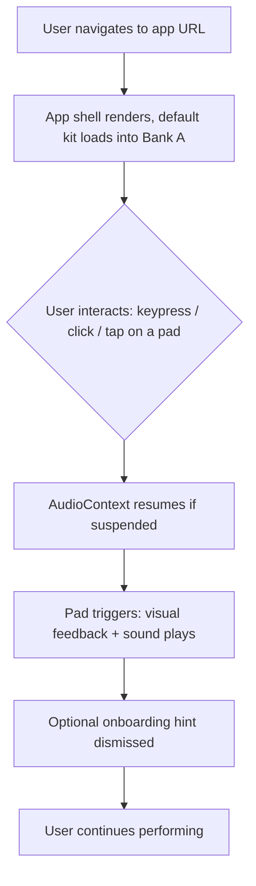
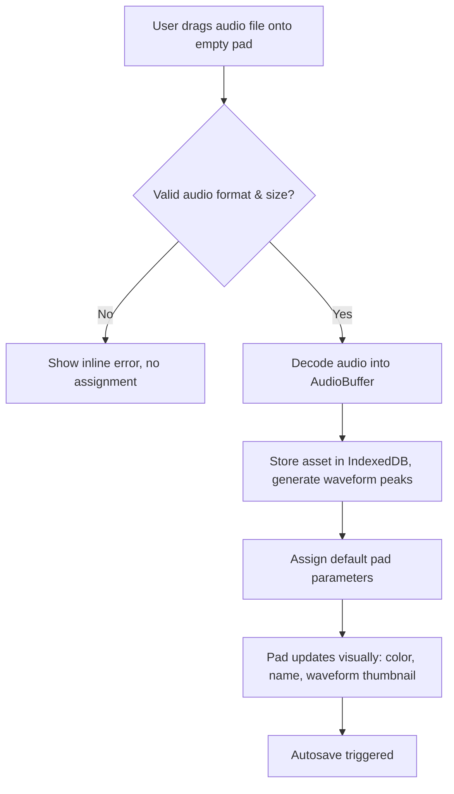
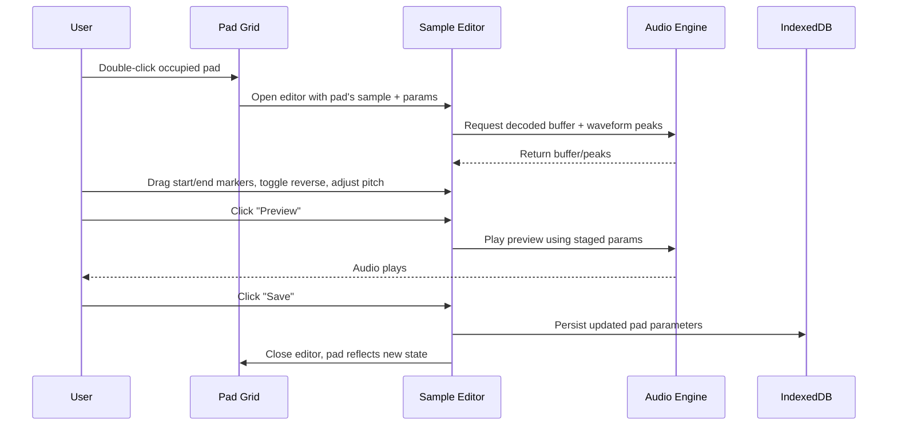
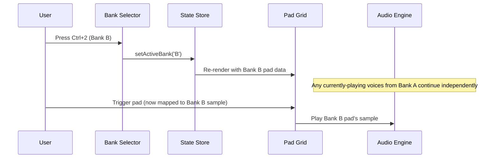

# 02 — Functional Specification Document (FSD)

## 1. Purpose & Conventions

This document translates the PRD's product goals into concrete, testable functional requirements. Every requirement has a unique ID, a priority, and an acceptance criterion. The implementing agent must satisfy all **P0** requirements for MVP; **P1** and **P2** are implemented in later phases per `11_IMPLEMENTATION_ROADMAP.md`.

**Priority definitions:**
- **P0** — Required for MVP launch. Product is not shippable without it.
- **P1** — Required for a complete v1 product experience; may ship in a fast-follow patch.
- **P2** — Enhancement; explicitly deferrable to post-v1.

**Requirement ID format:** `FR-<AREA>-<NUMBER>` (e.g., `FR-PAD-003`).

---

## 2. Functional Areas

1. Application Bootstrap & Audio Unlock
2. Pad Grid & Triggering
3. Keyboard Input
4. Mouse & Touch Input
5. Banks
6. Sample Assignment (Upload / Drag-Drop / Built-in Packs)
7. Sample Editor
8. Per-Pad Parameters Panel
9. Master Controls
10. Persistence (Save/Load/Autosave)
11. Project Import/Export
12. Onboarding & Empty States
13. Error Handling & Recovery
14. Settings

---

## 3. Application Bootstrap & Audio Unlock

### FR-BOOT-001 (P0) — Initial Load
The application shell (UI, pad grid, empty/default state) must render and become visually interactive within 2.5s on a broadband connection, cold cache, mid-range desktop hardware.

**Acceptance:** Lighthouse "Time to Interactive" < 2.5s for the initial route.

### FR-BOOT-002 (P0) — Deferred Audio Context
Per Web Audio API browser policy, the `AudioContext` must start in a suspended state and resume only after a user gesture (click/tap/keydown). The UI must not block on this — the pad grid is visible and "primed" immediately; the *first* interaction both unlocks audio and triggers the intended pad in the same gesture, with no separate "click to start" screen required unless a browser absolutely prevents this.

**Acceptance:** On first user interaction (any pad trigger), audio is audible from that same interaction with no second click required, on Chrome, Firefox, Safari desktop and mobile.

### FR-BOOT-003 (P1) — Default Kit Preload
On first-ever visit (no existing IndexedDB project), the app loads a default built-in sample pack into Bank A so the user has something to play immediately without any setup.

**Acceptance:** Fresh browser profile → load app → Bank A pads 1–8 (minimum) contain playable built-in sounds.

### FR-BOOT-004 (P0) — Returning User State Restore
On subsequent visits, the app loads the user's last saved project state from IndexedDB (all banks, pad assignments, parameters) instead of the default kit.

**Acceptance:** Assign a sample, change a pad parameter, refresh the page → state is identical post-refresh.

---

## 4. Pad Grid & Triggering

### FR-PAD-001 (P0) — Grid Layout
The main performance surface displays a 4×8 grid of 32 pads (rows: 4, columns: 8), matching the physical keyboard layout described in §5.

### FR-PAD-002 (P0) — Visual Trigger Feedback
When a pad is triggered by any input method, it must visually respond (e.g., brightness flash, scale pulse, color shift) within one animation frame of the triggering event, decoupled from audio decode/playback time.

**Acceptance:** Visual feedback begins ≤ 16ms after input event, independent of sample length or load state.

### FR-PAD-003 (P0) — Empty Pad State
A pad with no assigned sample is visually distinct (e.g., dimmed, outline-only, "+" affordance) and does not produce sound when triggered, but still shows a "no sample" micro-feedback (e.g., a subtle shake) so the user understands the input registered.

### FR-PAD-004 (P0) — Retrigger Behavior (One-Shot Mode)
In One-Shot mode, retriggering a pad while it is already playing starts a new overlapping voice; the previous voice continues to completion (polyphonic layering), up to the global voice limit (see `07_AUDIO_ENGINE.md`).

### FR-PAD-005 (P0) — Retrigger Behavior (Gate Mode)
In Gate mode, the sample plays only while the trigger is held (mouse/touch held down, or key held down) and stops (with release envelope applied) on release.

### FR-PAD-006 (P1) — Choke Groups (Deferred Design Hook)
The data model must reserve a `chokeGroup` field per pad (nullable) so that future versions can implement mutually-exclusive pad groups (e.g., open/closed hi-hat). Not required to be functional in v1, but the schema field must exist (see `08_DATABASE.md`).

### FR-PAD-007 (P0) — Mute
A muted pad produces no audio when triggered but still shows visual trigger feedback.

### FR-PAD-008 (P0) — Solo
When one or more pads in the active bank are soloed, only soloed pads produce audio; all others are implicitly silenced regardless of their own mute state. Solo state is scoped per-bank.

### FR-PAD-009 (P1) — Pad Context Menu
Right-click (desktop) or long-press (touch) on a pad opens a contextual menu with: Edit Sample, Rename, Change Color, Remove Sample, Duplicate Pad, Copy/Paste Pad Settings.

### FR-PAD-010 (P2) — Velocity-Sensitive Dynamics
Where the input method provides pressure/force data (e.g., pointer `pressure` on supporting devices), pad volume scales with input intensity. On devices without pressure data, triggers use a fixed default velocity (100%).

---

## 5. Keyboard Input

### FR-KEY-001 (P0) — Key Mapping
The following physical keys map to pads in row-major order (Pad 1 = top-left):

```
Row 1: 1 2 3 4 5 6 7 8
Row 2: Q W E R T Y U I
Row 3: A S D F G H J K
Row 4: Z X C V B N M ,
```

### FR-KEY-002 (P0) — Keydown Trigger, No Repeat
A `keydown` event triggers the corresponding pad exactly once per physical press; OS key-repeat (holding a key generating repeated `keydown` events) must NOT retrigger the pad. Implementation must track currently-held keys and ignore repeat events (`event.repeat === true` is discarded, or an explicit held-key set is maintained).

### FR-KEY-003 (P0) — Keyup Release (Gate Mode)
A `keyup` event on a pad's mapped key releases the pad if that pad is in Gate mode.

### FR-KEY-004 (P0) — Modifier Key Reservation
`Shift`, `Ctrl/Cmd`, `Alt`, and `Space` are reserved for application shortcuts (see `05_UI_UX.md` §Keyboard Shortcuts) and must never be treated as pad triggers.

### FR-KEY-005 (P0) — Input Focus Guard
When a text input, textarea, or contenteditable element has focus (e.g., renaming a pad, sample name field), keyboard events must NOT trigger pads, allowing normal typing.

### FR-KEY-006 (P1) — Non-QWERTY Keyboard Notice
The app detects (best-effort, via `KeyboardEvent.code` physical-position mapping rather than `key` value) and maps pads to physical key *positions* so the grid remains spatially consistent on AZERTY/QWERTZ layouts. A settings toggle allows switching between "physical position" and "printed character" mapping modes.

### FR-KEY-007 (P0) — Bank Switch Shortcuts
`Ctrl/Cmd + 1/2/3/4` (or equivalent documented shortcut) switches to Bank A/B/C/D respectively without affecting pad key mappings.

---

## 6. Mouse & Touch Input

### FR-MOUSE-001 (P0) — Click Trigger
`mousedown` on a pad triggers it. `mouseup` releases it (relevant for Gate mode).

### FR-MOUSE-002 (P0) — Touch Trigger
`touchstart` on a pad triggers it; `touchend`/`touchcancel` releases it (relevant for Gate mode). Touch must use `touch-action: none` on the pad grid to prevent scroll/zoom gestures from interfering with rapid tapping.

### FR-MOUSE-003 (P0) — Multi-Touch
Multiple simultaneous touch points on different pads must all register as independent triggers (true polyphonic multi-touch), up to the device's touch point limit.

### FR-MOUSE-004 (P0) — Click-Drag Across Pads (Finger Roll)
Dragging a mouse or finger across multiple pads while the pointer/touch remains "down" triggers each newly-entered pad once (common groovebox "finger roll" performance technique), without requiring separate mouseup/mousedown per pad.

### FR-MOUSE-005 (P1) — Hover Preview (Desktop Only)
On desktop, hovering a pad (no click) shows a lightweight preview tooltip: sample name, key mapping, duration. Does not trigger audio.

---

## 7. Banks

### FR-BANK-001 (P0) — Four Banks
The app supports exactly 4 banks (A, B, C, D) in v1, each with 32 independent pad slots. Architecture must not hard-code "4" in a way that prevents later expansion (see `03_TDD.md`).

### FR-BANK-002 (P0) — Bank Switch UI
Bank selector is always visible (see `05_UI_UX.md`). Switching banks re-renders the pad grid with the new bank's pad assignments in ≤ 1 frame, with no loading spinner.

### FR-BANK-003 (P0) — Bank Switch Does Not Interrupt Playing Voices
Sounds already triggered before a bank switch continue playing to completion (or until released, in Gate mode) after the switch, since voices are decoupled from the currently-displayed bank (see `07_AUDIO_ENGINE.md`).

### FR-BANK-004 (P1) — Per-Bank Naming
Each bank can be given a custom display name (e.g., "Drums", "Vocal Chops"), defaulting to "Bank A/B/C/D".

### FR-BANK-005 (P1) — Bank Copy
User can duplicate an entire bank's pad configuration into another (empty or occupied, with confirmation) bank.

---

## 8. Sample Assignment

### FR-SAMPLE-001 (P0) — Built-In Sample Packs
The app ships with at least 2 built-in sample packs (e.g., "Acoustic Kit", "Electronic Kit"), browsable via a Sample Browser panel, assignable to any pad via click-to-assign or drag-and-drop.

### FR-SAMPLE-002 (P0) — File Upload via Picker
Clicking an empty pad (or its "+" affordance) opens a file picker restricted to supported audio formats (WAV, MP3, OGG, FLAC, AIFF — validated by MIME type and extension).

### FR-SAMPLE-003 (P0) — Drag-and-Drop Upload
A user can drag an audio file from their OS file system directly onto a pad to assign it. Visual drop-target feedback (highlight) appears when a valid drag is over a pad.

### FR-SAMPLE-004 (P0) — Replace Sample
Assigning a new sample to an already-occupied pad replaces the previous assignment after a confirmation step (to prevent accidental overwrite), unless the user has disabled confirmations in Settings.

### FR-SAMPLE-005 (P0) — Remove Sample
User can clear a pad's sample assignment (via context menu or editor), returning it to the empty state. Underlying audio asset in storage is only deleted if no other pad references it (see `08_DATABASE.md` reference-counting).

### FR-SAMPLE-006 (P0) — Unsupported File Rejection
Uploading an unsupported file type or a file exceeding the max size limit (default: 50MB, configurable constant) shows a clear inline error and does not assign it to the pad.

### FR-SAMPLE-007 (P1) — Multi-File Drag onto Grid
Dragging multiple audio files onto the grid area (not a single pad) auto-assigns them sequentially to the next empty pads in the current bank, in file order.

### FR-SAMPLE-008 (P1) — Sample Library Panel
A persistent, collapsible panel lists all samples currently used anywhere in the project (built-in + user-uploaded), searchable by name, with drag-to-pad assignment.

---

## 9. Sample Editor

### FR-EDIT-001 (P0) — Editor Entry Point
Selecting "Edit" on an occupied pad (via context menu, double-click, or dedicated edit button) opens the Sample Editor for that pad's assigned sample.

### FR-EDIT-002 (P0) — Waveform Rendering
The editor renders an accurate waveform visualization of the full sample, generated from decoded audio data.

### FR-EDIT-003 (P0) — Zoom & Scroll
User can zoom in/out on the waveform (mouse wheel, pinch gesture, or +/- controls) and scroll horizontally when zoomed in, without losing marker positions.

### FR-EDIT-004 (P0) — Start/End Markers
Two draggable markers on the waveform define playback start and end points. Dragging updates a live-numeric readout (time and/or sample count). Markers cannot cross (start always < end, enforced with a minimum region width).

### FR-EDIT-005 (P0) — Playback Preview
A "preview" control plays the sample using current edit state (trimmed region, reverse, pitch, gain, fades) so the user hears changes before committing. Preview updates live as markers are dragged (post-drag, not necessarily during drag, to preserve performance).

### FR-EDIT-006 (P0) — Loop Toggle
Toggling Loop causes preview playback (and pad playback) to loop continuously between start/end markers until stopped/released.

### FR-EDIT-007 (P0) — Reverse
Toggling Reverse plays the trimmed region backward. Waveform display updates to reflect the reversed shape.

### FR-EDIT-008 (P0) — Normalize
A "Normalize" action analyzes peak amplitude within the trimmed region and applies the gain needed to bring the peak to a target level (default -1.0 dBFS), stored as an applied processing flag/value rather than mutating the source file.

### FR-EDIT-009 (P0) — Pitch Adjustment
A pitch control (semitone slider, -24 to +24, plus fine cents -100 to +100) adjusts playback pitch. Implementation choice (resampling vs. time-stretch) is documented in `07_AUDIO_ENGINE.md`; v1 uses simple playback-rate pitch shifting (changes duration).

### FR-EDIT-010 (P0) — Gain Adjustment
A gain control (dB, range -24 to +12) sets sample-level gain independent of the pad's overall Volume parameter (editor-level gain is "baked into" the sample's processing chain; pad Volume is a live performance control — the distinction is documented in §12 of `07_AUDIO_ENGINE.md`).

### FR-EDIT-011 (P0) — Fade In / Fade Out
Draggable fade handles at the start and end of the trimmed region (or numeric ms inputs) apply linear (v1) fade curves. Waveform overlay visually shows the fade shape.

### FR-EDIT-012 (P0) — Save / Cancel
Editor changes are staged locally within the editor session; "Save" commits changes to the pad's persisted parameters (and triggers autosave, see §10); "Cancel"/close-without-save discards them. Closing via the "X" or overlay-click prompts confirmation only if unsaved changes exist.

### FR-EDIT-013 (P1) — Keyboard Shortcuts in Editor
Space = play/pause preview; Home/End = jump markers to sample bounds; Arrow keys nudge selected marker by small increments (Shift+Arrow for larger increments).

### FR-EDIT-014 (P2) — Waveform Region Coloring
Trimmed-out regions (before start marker, after end marker) are visually dimmed relative to the active region.

---

## 10. Per-Pad Parameters Panel

### FR-PARAM-001 (P0) — Parameter Panel Access
Selecting a pad (single click, without opening the full editor) reveals a lightweight parameter panel (sidebar or drawer) showing: Volume, Pan, Pitch, Mute, Solo, Play Mode, Color, Name — editable without opening the full waveform editor.

### FR-PARAM-002 (P0) — Live Parameter Updates
Adjusting Volume/Pan/Pitch updates the audio graph in real time; if the pad is actively playing (looped or gated), the change is audible immediately.

### FR-PARAM-003 (P0) — Color Picker
A color picker (preset swatches + custom hex input) sets the pad's visual color, reflected instantly in the grid.

### FR-PARAM-004 (P0) — Name Editing
An inline-editable text field sets the pad's display name (max 32 characters), shown on the pad and in tooltips/context menus.

### FR-PARAM-005 (P1) — Attack/Release Envelope Controls
Attack and Release sliders (0–2000ms) shape the amplitude envelope applied on trigger/release, exposed in the parameter panel or editor.

### FR-PARAM-006 (P0) — Play Mode Toggle
A One-Shot / Gate toggle switch is directly accessible from the parameter panel.

---

## 11. Master Controls

### FR-MASTER-001 (P0) — Master Volume
A master volume fader controls overall output level, applied after all per-pad processing, persisted across sessions.

### FR-MASTER-002 (P1) — Master Mute
A single control mutes all output instantly (performance "panic" control), independent of per-pad mute states, and is reversible.

### FR-MASTER-003 (P1) — Output Level Meter
A visual meter (peak or RMS) reflects the master output level in real time.

### FR-MASTER-004 (P2) — Master Limiter
A brick-wall limiter on the master bus prevents clipping when many pads play simultaneously (architecture hook required regardless of P2 status — see `07_AUDIO_ENGINE.md`).

---

## 12. Persistence (Save / Load / Autosave)

### FR-PERSIST-001 (P0) — Autosave
Any change to pad assignments, parameters, bank configuration, or master settings is autosaved to IndexedDB within 500ms (debounced), without requiring explicit user action.

### FR-PERSIST-002 (P0) — Autosave Failure Handling
If autosave fails (e.g., quota exceeded), a non-blocking notification informs the user that changes are not being saved, with a link to Settings/storage management.

### FR-PERSIST-003 (P0) — Session Restore
On load, the app restores the most recent saved project state (see FR-BOOT-004).

### FR-PERSIST-004 (P1) — Named Projects (Local)
Users can save the current state as a named "project" and switch between multiple locally-stored projects via a project switcher.

### FR-PERSIST-005 (P1) — Manual Save Point
A manual "Save" action (in addition to autosave) creates an explicit restore point, useful before risky bulk edits.

---

## 13. Project Import / Export

### FR-IO-001 (P1) — Export Project
User can export the entire project (all banks, pad settings, and references to embedded audio data) as a single downloadable file (format defined in `08_DATABASE.md`).

### FR-IO-002 (P1) — Import Project
User can import a previously exported project file, which validates its schema/version before replacing or merging into the current state (user chooses replace vs. merge-into-empty-banks).

### FR-IO-003 (P2) — Single Kit Export/Import
Users can export/import a single bank as a shareable "kit" file, independent of the full project.

---

## 14. Onboarding & Empty States

### FR-ONBOARD-001 (P1) — First-Visit Hint Overlay
On a brand-new session (no saved project, default kit loaded per FR-BOOT-003), a lightweight, dismissible overlay/tooltip sequence highlights: pad triggering, bank switching, and the sample browser. Dismissed permanently after first interaction with a pad or explicit "Got it" dismissal.

### FR-ONBOARD-002 (P0) — Empty Bank State
A bank with zero assigned samples shows the empty-pad states described in FR-PAD-003 for all 32 pads, plus a subtle call-to-action to open the Sample Browser.

---

## 15. Error Handling & Recovery

### FR-ERROR-001 (P0) — Audio Decode Failure
If a sample fails to decode (corrupt file, unsupported codec variant), the pad shows an error state (distinct from empty) and a toast/notification names the failure; the pad remains non-destructively "assigned" so the user can attempt replacement without losing other pad data.

### FR-ERROR-002 (P0) — Storage Quota Exceeded
On IndexedDB write failure due to quota, the app surfaces a clear, actionable message and does not silently drop user data — the failed change remains in in-memory state (not lost) until the user frees space or dismisses.

### FR-ERROR-003 (P1) — AudioContext Suspension Recovery
If the browser suspends the `AudioContext` mid-session (e.g., tab backgrounded on mobile), the next user interaction automatically resumes it before triggering the intended pad, transparently.

---

## 16. Settings

### FR-SETTINGS-001 (P1) — Settings Panel
A settings panel exposes: master volume default, confirm-before-replace toggle, keyboard mapping mode (physical vs. printed, per FR-KEY-006), theme density (compact/comfortable), and storage usage summary with a "clear all data" destructive action (double-confirmed).

### FR-SETTINGS-002 (P2) — Latency Hint Configuration
Advanced setting exposing Web Audio `latencyHint` (`interactive` / `playback` / `balanced`) for users experiencing crackling on low-power devices.

---

## 17. Primary User Flows

### 17.1 Flow: First-Time Visitor Plays a Sound



### 17.2 Flow: Assigning a Custom Sample to a Pad



### 17.3 Flow: Editing a Sample



### 17.4 Flow: Bank Switching During Performance



---

## 18. Cross-Cutting Requirements

### FR-XCUT-001 (P0) — Responsive Layout
The full pad grid and essential controls (bank selector, master volume) must be usable on viewport widths from 360px (mobile) to 2560px+ (large desktop) without horizontal scrolling of the core performance surface.

### FR-XCUT-002 (P0) — No Data Loss on Crash
Because autosave is continuous (FR-PERSIST-001), a browser crash or accidental tab close must not lose more than the last 500ms of edits.

### FR-XCUT-003 (P1) — Accessibility Baseline
All interactive controls (outside the pad grid's performance-optimized surface) must be reachable via keyboard Tab order and have accessible names (see `05_UI_UX.md` §Accessibility for pad-grid-specific exceptions and rationale).

### FR-XCUT-004 (P0) — Offline Resilience
Once loaded, the app must continue to function fully offline (no network required for playback, editing, or persistence), enabled via a service worker / asset caching strategy (see `03_TDD.md`).
