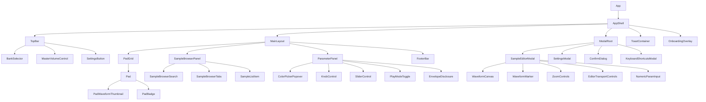

# 06 — Component Catalogue

## 1. Conventions

- All components are TypeScript function components using hooks.
- Naming: PascalCase component names matching filenames (`PadGrid.tsx` → `PadGrid`).
- Props interfaces are named `<ComponentName>Props`.
- "State" below refers to **local** component state (`useState`/`useReducer`); global state reads/writes are listed separately under "Store Interaction."
- Components are organized by feature folder (see `10_PROJECT_STRUCTURE.md`); this catalogue groups them the same way.

---

## 2. Component Tree (Top-Level)



---

## 3. Root & Shell Components

### 3.1 `App`
**Responsibility:** Root component. Initializes the Audio Engine singleton, hydrates state from Persistence, wraps the tree in the top-level Error Boundary and any global providers.
**Props:** none.
**Local State:** `isBootstrapped: boolean` (true once engine + persistence hydration complete).
**Store Interaction:** dispatches `projectSlice.hydrate(loadedProject)` once on mount.
**Children:** `AppShell` (rendered once `isBootstrapped` is true; otherwise a minimal `BootLoader`).

### 3.2 `BootLoader`
**Responsibility:** Minimal loading state shown before bootstrap completes (`05_UI_UX.md` §17).
**Props:** none. **Local State:** none.

### 3.3 `AppShell`
**Responsibility:** Overall page layout composition: renders `TopBar`, `MainLayout`, `ModalRoot`, `ToastContainer`, `OnboardingOverlay`. Registers global keyboard/pointer controller hooks (`useKeyboardController`, `usePointerRollController`) at this level so they are active app-wide regardless of which panels are open.
**Props:** none.
**Store Interaction:** reads `uiSlice.activeModal` to conditionally focus-trap when a modal is open.

### 3.4 `MainLayout`
**Responsibility:** Responsive 3-panel (or mobile-adapted) layout container. Decides panel visibility/mode (persistent vs. drawer vs. bottom-sheet) based on viewport width via a `useBreakpoint` hook.
**Props:** none.
**Local State:** none (breakpoint comes from hook, panel open/closed comes from `uiSlice`).
**Store Interaction:** reads `uiSlice.isSampleBrowserOpen`, `uiSlice.isParamPanelOpen`.

---

## 4. Top Bar Components

### 4.1 `TopBar`
**Responsibility:** Renders branding, `BankSelector`, `MasterVolumeControl`, `SettingsButton`. Fixed height per `05_UI_UX.md` §3.
**Props:** none.

### 4.2 `BankSelector`
**Responsibility:** Segmented control for switching active bank; displays custom bank names if set.
**Props:** none (self-contained via store).
**Local State:** none.
**Store Interaction:** reads `bankSlice.banks`, `bankSlice.activeBankId`; calls `bankSlice.setActiveBank(bankId)` on click. Also bound to `Ctrl/Cmd+1-4` via `useKeyboardController`.

### 4.3 `MasterVolumeControl`
**Responsibility:** Master volume slider + mute toggle + (P1) level meter.
**Props:** none.
**Local State:** `isDragging: boolean` (suppresses numeric-readout hide while actively dragging).
**Store Interaction:** reads/writes `settingsSlice.masterVolume`, `settingsSlice.masterMute`. On change, calls `useAudioEngineBinding().setMasterVolume(value)` (binding hook keeps Engine in sync — see §9).

### 4.4 `SettingsButton`
**Responsibility:** Icon button opening `SettingsModal` via `uiSlice.openModal('settings')`.
**Props:** none.

---

## 5. Pad Grid Components

### 5.1 `PadGrid`
**Responsibility:** Renders the 4×8 grid for the active bank. Purely a layout/mapping component — iterates `1..32` and renders a `Pad` for each slot index, passing only `bankId` + `slotIndex` (not full pad data) so each `Pad` subscribes independently and re-renders in isolation.
**Props:** none (reads `bankSlice.activeBankId`).
**Performance note:** This component itself should re-render only when the active bank ID changes, NOT when any individual pad's parameters change — achieved by each child `Pad` using its own scoped Zustand selector.

### 5.2 `Pad`
**Responsibility:** Single pad's full visual + interaction surface. Handles its own pointer events (`onPointerDown`/`onPointerUp`/`onPointerEnter` for finger-roll per `FR-MOUSE-004`), drag-and-drop target events, click-to-select, double-click-to-edit, and context menu.
**Props:**
```ts
interface PadProps {
  bankId: string;
  slotIndex: number; // 0-31
}
```
**Local State:** `isDragOver: boolean` (drag-and-drop visual feedback only).
**Store Interaction:**
- Reads: `padSlice.getPad(bankId, slotIndex)` (scoped selector — sample assignment, color, name, mute/solo, playMode).
- Reads (transient/ephemeral, not persisted): `engineUiSlice.isPadTriggered(padId)` — a lightweight, high-frequency-updating slice separate from persisted pad data, so trigger-flash re-renders never touch the persisted-state slice (performance isolation, per `03_TDD.md` principle 3).
- Writes: `uiSlice.selectPad(padId)` (single click), `uiSlice.openModal('sampleEditor', padId)` (double click/edit action).
- Calls (via binding hook): `usePadTrigger(padId)` returning `trigger()`/`release()` functions bound to pointer/drag handlers.
**Children:** `PadWaveformThumbnail`, `PadBadge` (mute/solo/error indicator).

### 5.3 `PadWaveformThumbnail`
**Responsibility:** Renders a small, low-res static waveform (precomputed peaks, not live WaveSurfer instance — performance) as a background watermark.
**Props:** `peaks: number[] | null; color: string`.
**Local State:** none. Pure render from precomputed peak data (no audio decoding at this layer).

### 5.4 `PadBadge`
**Responsibility:** Small icon badge overlay for mute/solo/error states.
**Props:** `state: 'mute' | 'solo' | 'error' | 'none'`.

### 5.5 `PadContextMenu`
**Responsibility:** Right-click/long-press contextual menu (`FR-PAD-009`).
**Props:** `padId: string; anchorPosition: {x:number,y:number}; onClose: () => void`.
**Store Interaction:** dispatches rename/color-change/duplicate/copy-paste/remove actions via `padSlice`.

---

## 6. Sample Browser Components

### 6.1 `SampleBrowserPanel`
**Responsibility:** Container for search, tabs, and list; handles collapse/expand and responsive drawer/bottom-sheet presentation.
**Props:** none.
**Local State:** `searchQuery: string`.
**Store Interaction:** reads `uiSlice.isSampleBrowserOpen`; reads sample lists via `domain` selectors (`useBuiltInSamples()`, `useUserSamples()`, `useProjectSamples()`).

### 6.2 `SampleBrowserSearch`
**Responsibility:** Debounced search input filtering the active tab's list.
**Props:** `value: string; onChange: (v: string) => void`.

### 6.3 `SampleBrowserTabs`
**Responsibility:** Tab switcher (Built-In / My Samples / This Project).
**Props:** `activeTab: SampleTab; onChange: (tab: SampleTab) => void`.
**Local State:** owns `activeTab` OR lifted to parent — recommendation: local state in `SampleBrowserPanel`, this component is presentational only, receiving `activeTab`/`onChange` as props.

### 6.4 `SampleListItem`
**Responsibility:** Single draggable sample row: thumbnail, name, duration; click-to-preview; drag-to-assign.
**Props:**
```ts
interface SampleListItemProps {
  assetId: string;
  name: string;
  durationSeconds: number;
  peaks: number[];
  onPreview: (assetId: string) => void;
}
```
**Local State:** `isPreviewing: boolean` (drives a small playing-indicator icon).

### 6.5 `UploadDropzone`
**Responsibility:** Wraps the Sample Browser's empty state and footer "+Upload" affordance; handles file-picker invocation and drag-and-drop of files onto the panel (distinct from drag onto a specific `Pad`, which the `Pad` component itself handles) — per `FR-SAMPLE-007` (multi-file drop onto grid area).
**Props:** `onFilesSelected: (files: File[]) => void`.

---

## 7. Parameter Panel Components

### 7.1 `ParameterPanel`
**Responsibility:** Container rendering all controls for the currently-selected pad; hidden when no pad selected.
**Props:** none.
**Store Interaction:** reads `uiSlice.selectedPadId`; if set, reads full pad data via `padSlice.getPad`.

### 7.2 `SliderControl` (generic, reused across app)
**Responsibility:** Reusable horizontal/vertical slider with label, numeric readout, drag + keyboard (arrow key) support.
**Props:**
```ts
interface SliderControlProps {
  label: string;
  value: number;
  min: number;
  max: number;
  step: number;
  unit?: string;
  orientation?: 'horizontal' | 'vertical';
  onChange: (value: number) => void;
  formatValue?: (value: number) => string;
}
```
**Local State:** `isDragging: boolean`.

### 7.3 `KnobControl` (generic, used for Pan)
**Responsibility:** Rotary-style control, drag-to-adjust (vertical drag distance maps to value change, standard pro-audio convention), double-click to reset to default/center.
**Props:** similar shape to `SliderControlProps` plus `defaultValue: number` (for double-click reset).

### 7.4 `PlayModeToggle`
**Responsibility:** Segmented One-Shot/Gate toggle.
**Props:** `value: 'oneshot' | 'gate'; onChange: (v: 'oneshot'|'gate') => void`.

### 7.5 `ColorPickerPopover`
**Responsibility:** 12-swatch preset grid + custom hex input, opens as a popover anchored to the color swatch trigger.
**Props:** `value: string; onChange: (hex: string) => void; onClose: () => void`.

### 7.6 `EnvelopeDisclosure`
**Responsibility:** Collapsible section wrapping Attack/Release `SliderControl`s (`FR-PARAM-005`).
**Props:** `defaultOpen?: boolean`.
**Local State:** `isOpen: boolean`.

### 7.7 `PadNameInput`
**Responsibility:** Inline-editable text field for pad display name, 32-char max, commits on blur/Enter.
**Props:** `value: string; onCommit: (name: string) => void`.

---

## 8. Sample Editor Components

### 8.1 `SampleEditorModal`
**Responsibility:** Top-level modal orchestrating the editor session: loads the target pad's asset + current params into **local staged state** (not written to the global store until Save), renders `WaveformCanvas` and all editor controls, handles Save/Cancel/unsaved-changes confirmation.
**Props:** `padId: string; onClose: () => void`.
**Local State:** `stagedParams: PadEditableParams` (full working copy: start/end markers, pitch, gain, fades, reverse, loop, normalize-applied flag), `isDirty: boolean`, `isPreviewing: boolean`.
**Store Interaction:** reads initial pad data once on open (`padSlice.getPad`); on Save, calls `padSlice.updatePadParams(padId, stagedParams)` (single atomic update) then closes.
**Engine Interaction:** calls `sampleEditorEngine.loadForEditing(assetId)`, `sampleEditorEngine.previewPlay(stagedParams)`, `sampleEditorEngine.previewStop()` — a dedicated Engine subsystem separate from live pad playback voices (see `07_AUDIO_ENGINE.md` §Preview Player).

### 8.2 `WaveformCanvas`
**Responsibility:** Wraps the WaveSurfer.js instance; renders waveform, playhead, region overlay (active/dimmed zones), and hosts the draggable marker/fade-handle overlays. Emits marker-position-change callbacks up to `SampleEditorModal`.
**Props:**
```ts
interface WaveformCanvasProps {
  peaks: number[];
  durationSeconds: number;
  startMarker: number; // normalized 0-1
  endMarker: number;
  fadeInMs: number;
  fadeOutMs: number;
  playheadPosition: number; // 0-1, updated during preview
  zoomLevel: number;
  onMarkersChange: (start: number, end: number) => void;
  onFadesChange: (fadeInMs: number, fadeOutMs: number) => void;
  onSeek: (position: number) => void;
}
```
**Local State:** internal WaveSurfer instance ref (via `useRef`), managed in `useEffect` lifecycle tied to `peaks`/container mount.

### 8.3 `WaveformMarker`
**Responsibility:** A single draggable marker handle (start, end, fade-in, or fade-out), rendered as an absolutely-positioned overlay element on top of `WaveformCanvas`, using pointer-capture drag handling.
**Props:** `type: 'start'|'end'|'fadeIn'|'fadeOut'; positionPercent: number; onDrag: (positionPercent: number) => void`.

### 8.4 `ZoomControls`
**Responsibility:** Zoom in/out buttons, zoom slider, "Fit to Window" button.
**Props:** `zoomLevel: number; onZoomChange: (level: number) => void; onFitToWindow: () => void`.

### 8.5 `EditorTransportControls`
**Responsibility:** Preview play/pause button, Reverse toggle, Loop toggle, Normalize action button.
**Props:** `isPreviewing: boolean; reverse: boolean; loop: boolean; onPreviewToggle: () => void; onReverseToggle: () => void; onLoopToggle: () => void; onNormalize: () => void`.

### 8.6 `NumericParamInput`
**Responsibility:** Small numeric input paired with sliders (pitch, gain, fades) for precise value entry; supports keyboard arrow increment/decrement.
**Props:** `value: number; min: number; max: number; step: number; unit: string; onChange: (v: number) => void`.

---

## 9. Binding Hooks (Not Components, but Cataloged Here for Completeness)

| Hook | Responsibility |
|---|---|
| `useKeyboardController()` | Registers global `keydown`/`keyup` listeners; resolves key → padId via active bank + key map; calls `usePadTrigger` trigger/release; enforces no-repeat (`FR-KEY-002`) and input-focus guard (`FR-KEY-005`) |
| `usePointerRollController()` | Tracks pointer-down state across the grid to implement finger-roll (`FR-MOUSE-004`) |
| `usePadTrigger(padId)` | Returns `{ trigger(velocity?), release() }`; calls `AudioEngine.triggerPad`/`releasePad` AND sets ephemeral `engineUiSlice` triggered-state for visual feedback, in parallel (per `04_ARCHITECTURE.md` §4) |
| `useAudioEngineBinding()` | Subscribes to relevant `padSlice`/`settingsSlice` changes (volume, pan, pitch, mute, solo, master volume) and pushes them into live `AudioEngine` graph nodes reactively |
| `useSampleUpload()` | Wraps `SampleAssignmentService` (domain layer) for use in components; exposes `assignFile(padId, file)`, `assignBuiltIn(padId, sampleId)`, loading/error state |
| `useBreakpoint()` | Returns current responsive breakpoint (`mobile`/`tablet`/`desktop`/`desktop-lg`) via `matchMedia` |
| `useAutosave()` | Subscribes to relevant store slices, debounces (500ms), calls `ProjectRepository.save()` |

---

## 10. Modals & Overlays

### 10.1 `ModalRoot`
**Responsibility:** Renders the currently-open modal (if any) based on `uiSlice.activeModal`, handles portal mounting, scrim, and focus trap.
**Props:** none.

### 10.2 `SettingsModal`
**Responsibility:** Renders settings sections per `FR-SETTINGS-001`: master defaults, confirmation toggles, keyboard mapping mode, theme density, storage usage + clear-data action.
**Props:** `onClose: () => void`.
**Store Interaction:** reads/writes `settingsSlice`.

### 10.3 `ConfirmDialog`
**Responsibility:** Generic reusable confirmation dialog (used for: replace sample, remove sample, clear all data, discard unsaved editor changes).
**Props:**
```ts
interface ConfirmDialogProps {
  title: string;
  message: string;
  confirmLabel: string;
  cancelLabel: string;
  destructive?: boolean;
  onConfirm: () => void;
  onCancel: () => void;
}
```

### 10.4 `KeyboardShortcutsModal`
**Responsibility:** Static reference table of all shortcuts (`05_UI_UX.md` §14), opened via `?` key.
**Props:** `onClose: () => void`.

### 10.5 `OnboardingOverlay`
**Responsibility:** First-visit spotlighted tooltip sequence (`05_UI_UX.md` §11).
**Props:** none.
**Local State:** `currentStep: number`.
**Store Interaction:** reads/writes a lightweight local flag (`settingsSlice.hasSeenOnboarding` or a separate localStorage flag, not full project data).

### 10.6 `ToastContainer` / `Toast`
**Responsibility:** Renders stacked notifications per `05_UI_UX.md` §12.
**Props (Toast):** `id: string; type: 'success'|'warning'|'error'|'info'; message: string; onDismiss: (id: string) => void`.
**Store Interaction:** subscribes to `uiSlice.toasts`.

---

## 11. Footer Components

### 11.1 `FooterBar`
**Responsibility:** Renders `StorageIndicator` and `SaveStatusIndicator`; reserved layout space for future transport controls.
**Props:** none.

### 11.2 `StorageIndicator`
**Responsibility:** Shows approximate IndexedDB usage vs. quota (via `navigator.storage.estimate()`), warns when near limit.
**Props:** none. **Local State:** `estimate: {usage: number, quota: number} | null`, refreshed periodically/on relevant events.

### 11.3 `SaveStatusIndicator`
**Responsibility:** Shows "Saved" / "Saving…" / "Save failed" based on autosave state.
**Store Interaction:** reads `uiSlice.autosaveStatus`.

---

## 12. Component Responsibility Summary Table

| Component | Layer | Re-renders on |
|---|---|---|
| `PadGrid` | Presentation | Active bank change only |
| `Pad` | Presentation | Its own pad data OR its own transient trigger state |
| `BankSelector` | Presentation | Bank list / active bank change |
| `ParameterPanel` | Presentation | Selected pad ID change, or that pad's data change |
| `SampleEditorModal` | Presentation (with local staged state) | Local staged state only; does not subscribe to global pad data after initial load |
| `MasterVolumeControl` | Presentation | Master volume/mute settings |
| `SampleBrowserPanel` | Presentation | Panel open/close, sample lists, search query |

This table is the basis for performance-review checkpoints in `12_TESTING.md` (verifying no over-rendering via React DevTools Profiler).
