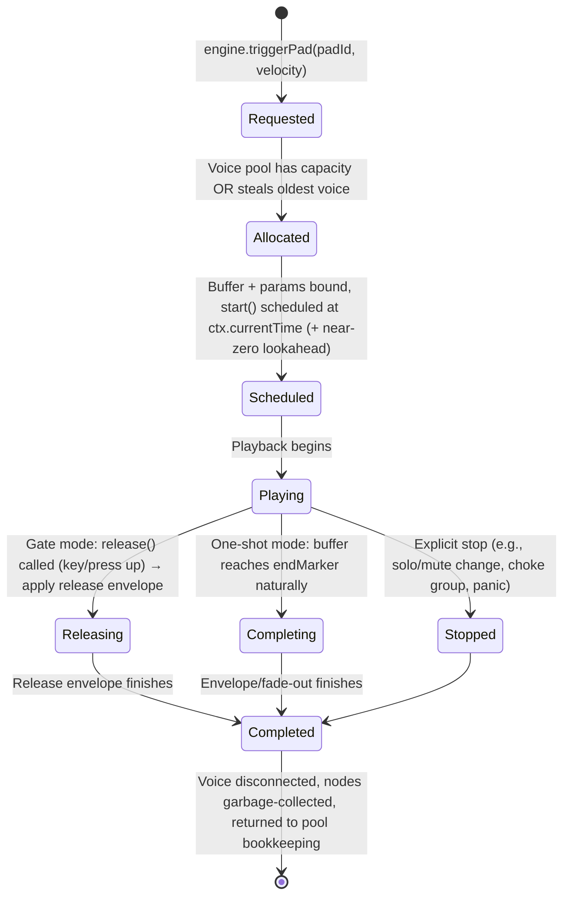
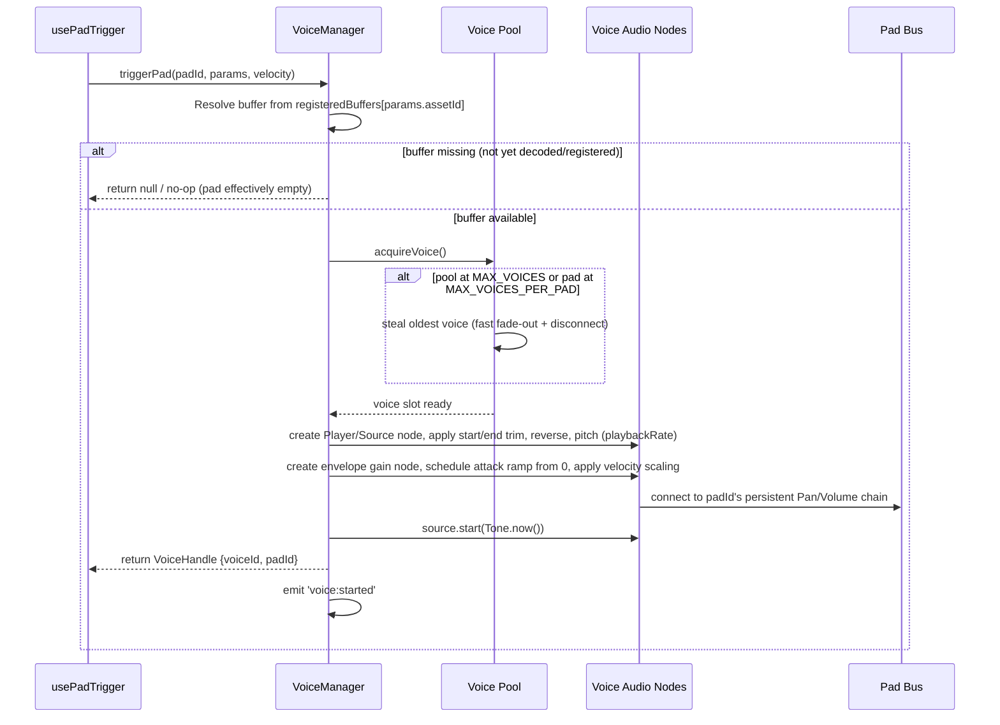

# 07 — Audio Engine Design

## 1. Purpose & Scope

This document fully specifies the Audio Engine layer (`/src/audio-engine`): the audio graph topology, voice lifecycle, scheduling model, public API contract, and performance strategy. It is the normative reference for implementing `AudioEngine` and its subsystems. The engine is framework-agnostic TypeScript built on Tone.js (`03_TDD.md` §3.2).

---

## 2. Foundational Concepts

### 2.1 Voice
A **voice** is one instance of a sample currently sounding (or scheduled to sound). A single pad may have multiple voices active simultaneously in One-Shot mode (layered retriggers). A voice owns its own small audio node chain and is destroyed/returned to the pool when playback completes or is stopped.

### 2.2 Pad Signal Chain vs. Voice Signal Chain
Each **pad** (not each voice) owns a **persistent** processing chain (Pan → Volume/Gain) representing its live performance controls. Each **voice** created for that pad routes through a **transient** per-voice chain (Player/Source → Envelope Gain) which then connects into the pad's persistent chain. This separation allows live adjustment of a pad's volume/pan to affect all its current and future voices uniformly, while each voice independently manages its own attack/release envelope and fade in/out without interfering with sibling voices.

### 2.3 Buses
- **Pad Bus**: per-pad summing point (Pan/Volume), one per pad slot (128 total across all banks — engine holds these for all banks simultaneously, not just the active one, satisfying `FR-BANK-003`: voices from an inactive bank continue playing because their pad bus and voices are never destroyed on bank switch, only the UI's *displayed* bank changes).
- **Master Bus**: single summing point for all pad buses; hosts Master Volume, Master Mute, (future) Master Limiter and effects sends.

---

## 3. Audio Graph Topology

```mermaid
graph LR
    subgraph "Per Voice (transient, created on trigger, destroyed on completion)"
        Src[Tone.Player / BufferSource] --> Env[Envelope Gain Node - Attack/Release/Fades]
    end
    subgraph "Per Pad (persistent, one per pad slot, all 128 slots exist regardless of active bank)"
        Env --> PadGain[Pad Volume Gain]
        PadGain --> PadPan[Pad Panner]
    end
    subgraph "Master Bus (singleton)"
        PadPan --> MasterGain[Master Volume Gain]
        MasterGain --> MasterMuteGate[Master Mute Gain 0/1]
        MasterMuteGate --> Limiter[Master Limiter - reserved P2]
        Limiter --> Analyser[AnalyserNode - for level meter]
        Analyser --> Destination[AudioContext.destination]
    end
```



**Note on future effects (`14_FUTURE_FEATURES.md`):** the Master Bus reserves an explicit insertion point between `MasterMuteGate` and `Limiter` for a future effects chain (reverb/delay sends), and each Pad Bus reserves an insertion point between `PadPan` and the connection to `MasterGain` for future per-pad insert effects. These insertion points must exist as no-op pass-through connections in v1 so adding effects later does not require re-wiring the graph.

---

## 4. Voice Lifecycle



### 4.1 Voice Allocation & Stealing Policy
- Global maximum concurrent voices: **32** (configurable constant `MAX_VOICES`), matching the performance budget in `03_TDD.md`.
- When at capacity and a new trigger arrives: the engine steals the **oldest currently-playing voice across all pads** (simple FIFO stealing for v1), applying a fast 5ms fade-out on the stolen voice to avoid clicks before disconnecting it.
- Per-pad voice cap (secondary limit): a single pad may have at most **8** simultaneous overlapping voices (configurable `MAX_VOICES_PER_PAD`) to prevent one rapidly-retriggered pad from starving the whole instrument's polyphony budget.

---

## 5. Scheduling Model — Immediate vs. Transport-Based

Two distinct scheduling paths coexist by design (`03_TDD.md` §3.2):

| Path | Used For | Mechanism |
|---|---|---|
| **Immediate Trigger Path** | Live pad performance (keyboard/mouse/touch) | Directly computes `const when = Tone.now()` (or `context.currentTime`) with effectively zero added lookahead; calls `source.start(when)` synchronously within the input event handler's call stack |
| **Transport Path** (future, reserved) | Step sequencer playback (`14_FUTURE_FEATURES.md`) | Uses `Tone.Transport` + `Tone.Sequence`/scheduled events with standard lookahead scheduling for sample-accurate quantized playback |

Both paths converge on the same underlying `VoiceManager.playVoice(padId, params, startTime)` primitive — the only difference is how `startTime` is computed and by whom. This guarantees the future sequencer does not require Engine internals to change, only a new caller.

---

## 6. Public Engine API Contract

The Engine exposes the following imperative TypeScript interface to the Binding Layer (`06_COMPONENTS.md` §9). This is the ONLY surface the rest of the app is permitted to call.

```ts
interface AudioEngine {
  // Lifecycle
  initialize(): Promise<void>; // creates AudioContext (suspended), sets up master bus graph
  resumeContext(): Promise<void>; // called on first user gesture; idempotent

  // Buffer / Asset registration (called by Domain layer after decode)
  registerBuffer(assetId: string, buffer: AudioBuffer): void;
  unregisterBuffer(assetId: string): void; // frees memory when no pad references it

  // Performance triggering (Immediate Path)
  triggerPad(padId: string, params: PadPlaybackParams, velocity?: number): VoiceHandle;
  releasePad(padId: string): void; // relevant only for Gate-mode pads; no-op otherwise
  stopPad(padId: string, fadeMs?: number): void; // explicit stop, e.g. for solo/mute/panic

  // Live parameter updates (called reactively by useAudioEngineBinding)
  setPadVolume(padId: string, volume: number): void;
  setPadPan(padId: string, pan: number): void;
  setPadMute(padId: string, muted: boolean): void; // gates the pad bus, does not stop existing voices abruptly—applies fast fade
  setMasterVolume(volume: number): void;
  setMasterMute(muted: boolean): void;

  // Preview Player (Sample Editor subsystem — see §9)
  previewPlay(assetId: string, editParams: SampleEditParams): void;
  previewStop(): void;
  previewSeek(positionNormalized: number): void;
  getPreviewPlayheadPosition(): number;

  // Introspection
  getActiveVoiceCount(): number;
  getMasterLevel(): { peak: number; rms: number }; // for level meter, sampled from AnalyserNode

  // Events (for transient UI updates that should NOT go through global state)
  on(event: 'voice:started' | 'voice:ended', handler: (payload: VoiceEventPayload) => void): () => void; // returns unsubscribe
}
```

### 6.1 `PadPlaybackParams` (passed into `triggerPad`, derived from persisted pad state)
```ts
interface PadPlaybackParams {
  assetId: string;
  startMarker: number;   // 0-1 normalized
  endMarker: number;     // 0-1 normalized
  reverse: boolean;
  loop: boolean;
  pitchSemitones: number;
  gainDb: number;        // baked "editor" gain, distinct from live pad volume
  attackMs: number;
  releaseMs: number;
  fadeInMs: number;
  fadeOutMs: number;
  playMode: 'oneshot' | 'gate';
}
```

---

## 7. Trigger Sequence (Detailed)



---

## 8. Pitch, Trim, Reverse, Loop — Implementation Notes

- **Trim (start/end markers):** implemented via `Tone.Player`'s built-in region playback (or, if using raw `AudioBufferSourceNode`, via `start(when, offset, duration)` parameters) — computed from `startMarker`/`endMarker` normalized values × `buffer.duration`.
- **Reverse:** v1 implementation reverses the underlying `AudioBuffer`'s channel data once at assignment/edit-save time (producing a cached reversed buffer variant stored alongside the forward buffer in the Engine's buffer registry, keyed as `${assetId}::reversed`), rather than reversing in real time per trigger — this trades a small memory cost for zero per-trigger CPU cost, protecting the latency budget.
- **Pitch:** v1 implements pitch via `playbackRate` adjustment (`Tone.Player.playbackRate` or `AudioBufferSourceNode.playbackRate`), computed as `2^(semitones/12)`. This is documented as changing sample duration (higher pitch = shorter playback), which is acceptable and standard for a sampler/groovebox (matches classic MPC/hardware sampler behavior). True time-stretch (pitch without duration change) is deferred — see `14_FUTURE_FEATURES.md`.
- **Loop:** sets `player.loop = true` with `loopStart`/`loopEnd` bound to the trim markers; loop playback continues until `releasePad`/`stopPad` is called (Gate mode) or the pad is retriggered/muted (One-Shot loop pads are an intentional "toggle to stop" performance pattern — retriggering a currently-looping one-shot pad stops it rather than layering, as a documented UX exception to `FR-PAD-004` specifically for `loop === true` pads, since layering infinite loops indefinitely is almost never the desired musical behavior).

---

## 9. Preview Player (Sample Editor Subsystem)

The Sample Editor needs playback that reflects **staged, uncommitted** edits (`FR-EDIT-005`). This is implemented as a dedicated, single-voice subsystem (`PreviewPlayer`), separate from the main `VoiceManager`:
- Only ever has 0 or 1 active voice (starting a new preview stops any prior preview immediately).
- Connects directly to a dedicated preview gain node → master bus (or a separate "preview" output gain, so preview volume can be independently managed without affecting live pad levels — recommended: route through the same master bus to accurately represent final output).
- Re-triggered on every relevant staged-parameter change if the user is actively scrubbing/previewing, OR only on explicit "Preview" button press — **v1 decision: explicit button press only**, to avoid excessive re-triggering during rapid marker dragging; live-updating preview-while-dragging is a P2 enhancement.
- Exposes `getPreviewPlayheadPosition()` polled via `requestAnimationFrame` in `WaveformCanvas` to animate the playhead.

---

## 10. Envelope Model

- **Attack**: linear ramp of the voice's envelope gain node from `0` to `1 * velocityScale` over `attackMs`, starting at trigger time. Default `0ms` (instant on) unless user sets a value.
- **Release**: linear (v1) ramp from current gain value to `0` over `releaseMs`, starting at `releasePad()` call time (Gate mode) or naturally after the trimmed region completes if `releaseMs > 0` is treated as a tail (One-Shot mode plays the release tail after reaching `endMarker`, extending actual audible duration by `releaseMs`).
- **Fade In / Fade Out** (from Sample Editor, `FR-EDIT-011`): distinct from Attack/Release — these are baked into the *processing* of the sample's edit parameters and are applied identically on every trigger, representing a sound-design choice (part of the sample's character) rather than a live-performance envelope. Implementation: additional gain automation applied at the very start/end of the trimmed region, composed with (multiplied against) the Attack/Release envelope at playback time.
- All gain ramps use `AudioParam.linearRampToValueAtTime` (v1) — exponential ramps are a documented future refinement for more natural-sounding fades if needed.

---

## 11. Solo / Mute Resolution Logic

Computed reactively whenever any pad's mute/solo state changes, scoped per-bank (`FR-PAD-008`):
```
for each pad in activeBank:
  anySoloed = exists pad in activeBank where pad.solo === true
  pad.effectiveAudible =
    if anySoloed: pad.solo === true
    else: pad.mute === false
```
`effectiveAudible` is pushed to the Engine via `setPadMute(padId, !effectiveAudible)` — implemented as a fast (10ms) gain ramp on the Pad Bus gain node to `0`/`1`, not a hard disconnect, to avoid audible clicks. Since Pad Buses persist across all banks simultaneously (§2.3), muting is scoped correctly even though voices from a previous bank may still be playing — solo/mute resolution only affects pads within the currently active bank's logical grouping, but the underlying gain nodes exist per pad-slot-across-all-banks (128 total), so switching banks re-evaluates and re-applies this resolution against the newly active bank's pad set.

---

## 12. Live Volume vs. Editor Gain — Clarification

Two distinct gain concepts exist and must not be conflated in implementation:
1. **Pad Volume** (`padSlice` parameter, `FR-PARAM` area): a **live performance control**, adjustable at any time, applied at the persistent Pad Bus gain node (§2.2), affects all current and future voices for that pad immediately.
2. **Editor Gain** (`FR-EDIT-010`, part of `PadPlaybackParams.gainDb`): a **sound-design/normalization control**, baked into each voice's source chain at trigger time (applied once per voice, not live-adjustable after the fact without reopening the editor). Represents "this sample was quiet, so boost it by default" — analogous to normalizing a sample in a hardware sampler.

Both ultimately multiply together in the signal path (`Voice Envelope Gain [includes editor gain] → Pad Bus Gain [live volume] → Master`), but they are exposed as separate, independently-persisted parameters (see `08_DATABASE.md`).

---

## 13. Performance Optimizations

| Technique | Purpose |
|---|---|
| Pre-decode all buffers at assignment time, never at trigger time | Removes decode latency from the critical trigger path (`03_TDD.md` §5 budget) |
| Pre-computed reversed buffer variant cached alongside forward buffer | Avoids per-trigger reverse computation |
| Voice pooling with FIFO stealing at `MAX_VOICES` | Bounds CPU/memory, prevents unbounded node creation under heavy performance |
| Persistent Pad Bus nodes (created once at engine init for all 128 pad slots) | Avoids node creation/teardown overhead on every parameter change or bank switch |
| `AudioParam` automation (ramps) instead of JS-driven gain loops | Offloads envelope/fade timing to the audio thread, immune to main-thread jank |
| Waveform peaks pre-computed once at upload/decode time and cached (IndexedDB) | Avoids recomputing peaks on every editor open |
| Visual feedback decoupled from audio scheduling promise chain (`04_ARCHITECTURE.md` §4) | Guarantees UI responsiveness independent of audio subsystem timing |
| `requestAnimationFrame`-driven UI polling (playhead, level meter) rather than audio-thread-driven callbacks | Keeps UI updates off the audio rendering thread entirely |
| Lazy-load non-active-bank sample buffers only when first needed (P1 optimization) | Reduces initial memory footprint for projects with all 4 banks fully populated; MUST still be triggerable within budget on first play (pre-fetch in the background if bandwidth/CPU allows) |

---

## 14. Latency Budget Breakdown (Desktop Target: ≤30ms input→audible)

| Stage | Budget |
|---|---|
| Input event dispatch (browser) | ~1-5ms (platform-dependent, outside app control) |
| Event handler execution (resolve padId, call `triggerPad`) | ≤2ms |
| Voice acquisition + node creation | ≤3ms |
| `AudioContext` scheduling overhead (`Tone.now()` to actual DSP callback) | ~5-10ms (platform/buffer-size dependent, minimized via `latencyHint: 'interactive'`) |
| Hardware output buffer latency | ~10-15ms (platform-dependent, outside app control past `latencyHint` setting) |

The application-controlled portion (event handling + node creation) must stay under **5ms**; the remainder is inherent platform/hardware latency that `latencyHint: 'interactive'` (set at `AudioContext`/`Tone.context` initialization) minimizes as much as the browser allows.

---

## 15. Error Handling in the Engine

| Failure | Engine Behavior |
|---|---|
| `decodeAudioData` throws (corrupt file) | Reject the calling promise with a typed `AudioDecodeError`; Domain layer catches and surfaces `FR-ERROR-001` |
| `triggerPad` called for a padId with no registered buffer | No-op, returns `null` `VoiceHandle`, logs a debug-level warning (not an error — this is a normal "empty pad tapped" case) |
| `AudioContext` in `suspended` or `interrupted` state at trigger time | `triggerPad` internally awaits `resumeContext()` first (fire-and-forget from the caller's perspective — the Binding Layer calls `resumeContext()` proactively on every input event as a cheap idempotent no-op when already running) |
| Voice pool exhausted and stealing fails (should not occur given FIFO policy, but defensive) | Drop the new trigger silently, log a warning; never throw into the UI event handler |

---

## 16. Testability

The Engine must be unit-testable without a real browser audio backend where feasible:
- Core logic (voice allocation, stealing policy, param computation, solo/mute resolution) is implemented in pure functions/classes that accept an injected `AudioContext`-like interface, allowing substitution of a mock/stub context in Vitest (see `12_TESTING.md`).
- Timing-dependent behavior (actual DSP output) is validated via Playwright browser-based tests capturing real audio graph state (`context.state`, node connection counts) rather than asserting on rendered audio samples in unit tests.
